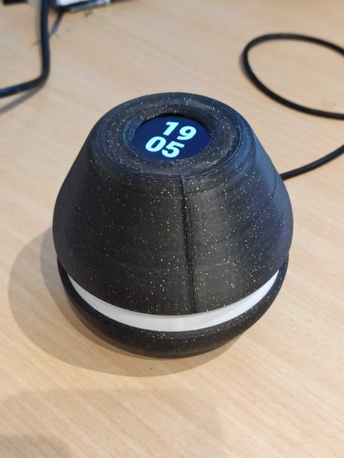
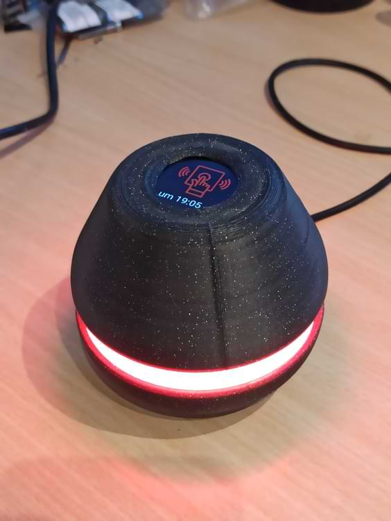
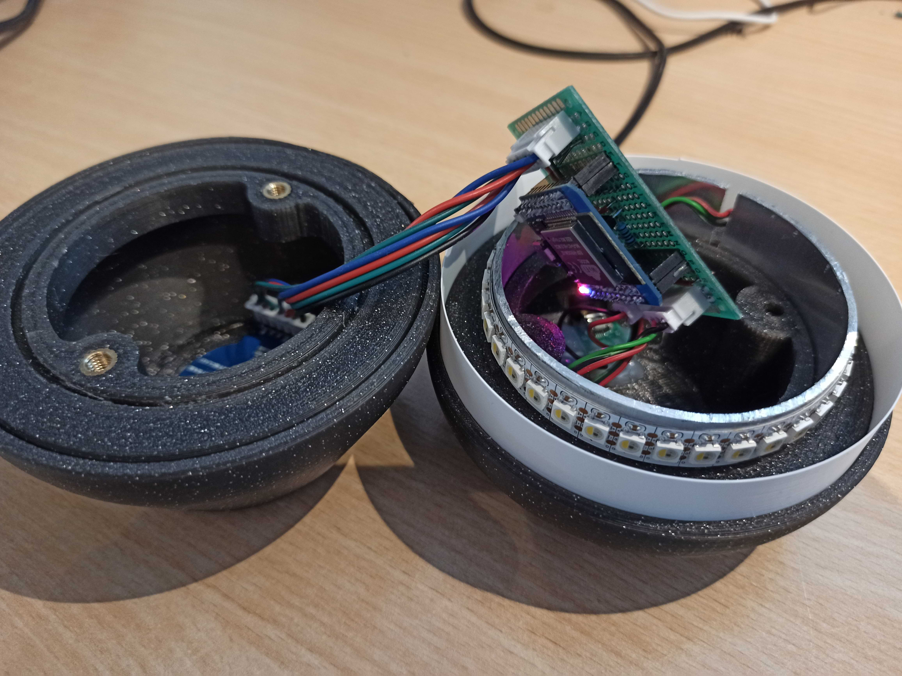
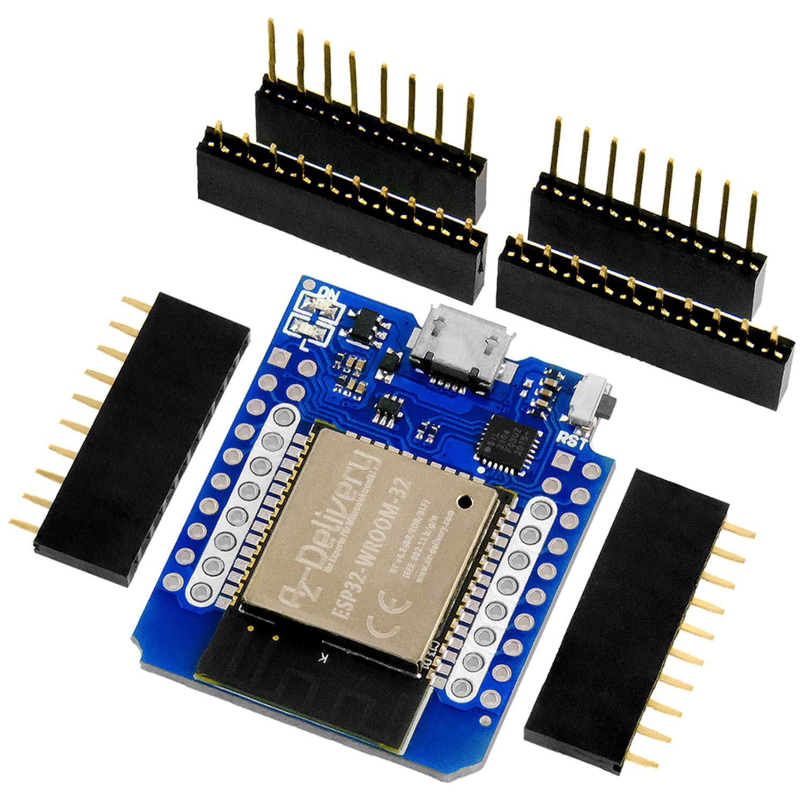
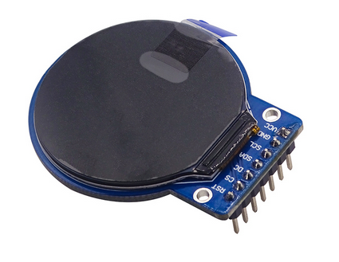
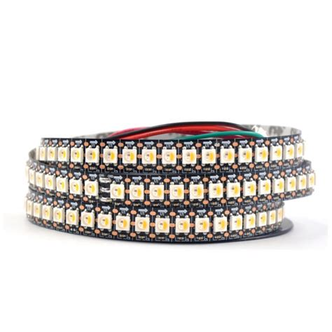

# NotificationEgg
 
This repository contains all files needed to build a notification egg.

[Video of the egg in action](https://giant.gfycat.com/CourteousFlatCygnet.mp4) (*egg*-tion?)





[Link to original reddit post](https://www.reddit.com/r/homeassistant/comments/vv33gt/i_made_this_egg_that_shows_multiple_notifications/)

## BOM
| Picture | Role | Component | Comment |
|-|-|-|-|
||Microcontroller | ESP32 | ESP8266 is sufficient for displays with smaller resolution/color space due to their RAM requirements.<br> I used a WeMos D1 Mini ESP32 for its compact form.|
|| Display | GC9A01 | I love the look of this round 240x240 screen, but it requires a lot of RAM to drive. In an earlier version, I used a SSD1306 0.96" OLED (STL included)|
|| LED Strip | SK6812 (144LED/m) | More LEDs make for a smoother effect. If you want to go with a non-addressable LED strip, maybe my horrible ESPHome effect can serve as a starting point for you|

### Miscellaneous/optional components
- MicroUSB Breakout Module: Helps so I don't have to position the ESP near the hole for the wire, also provides some sort of strain relief. Hotglued to the bottom of the inside.
- 80mm x 2mm Aluminium Tube: Cut to 18mm length and added a slot for the wires of the LED strip. Serves as unnecessary heatsink for the LEDs, but the adhesive sticks better to it than to the printed ring...
- 2 M5 threaded heat inserts: Can be inserted into the top to attach the halves together with some ~30mm+ M5 bolts. In hindsight not necessary, my friction fit of the aluminium tube is strong enough so it doesn't come apart easily.
- Perfboard & Connectors: For connecting ESP and the rest. I don't like to solder stuff directly to my MCUs, mostly for misplaced reusability. I used JST XH connectors. I hate crimping...
- Transistor & Resistor: I used a BC337-40 NPN transistor connected via a 1k resistor to the ESP as an electrical switch between the MCU's and the display's `GND` so the MCU can completely turn off the display. However, I didn't expand on this feature (yet?)

## Wiring
Wiring is mostly self-explanatory. All pins of the components are connected to the ESP according to the ESPHome YAML configuration. Change at your own will. Since I was using a MicroUSB breakout board, I connected the 5V of the LED strip directly to it instead of through the ESP board.

## Software
The device is controlled via MQTT. It subscribes to a topic `esphome/{devicename}/notify/{COLOR}` for each `COLOR` in `red`,`green`,`blue`,`cyan`,`yellow` and `magenta` (where `{devicename}` is set at the top of the config). When a timestamp (in: seconds since 01.01.1970) is published to that topic, the device interprets this timestamp as an "expiration date" for the notification of that color. If a timestamp arrives which has an earlier expiration date than a previous notification of this color, it is ignored. When a timestamp of `0` is received, the notification gets cancelled immediately, no matter its original expiration date.
### Firmware
The firmware for the ESP is built and uploaded by [ESPHome](https://esphome.io) using `esphome run notification_egg.yaml`. If you don't know about ESPHome, make sure to check it out, it is a simple and awesome way to create firmware for ESP based devices that provides many handy features, like automatic MQTT exposure for your components as well as seamless integration with Home Assistant via their native API or MQTT discovery.

Currently, there are 2 versions: `notification_light.yaml`, which only controls an LED strip and `notification_light_with_display.yaml`, which adds support for the GC9A01 display. In any case, make sure to change the GPIO pins in the `substitutions` section on top of the file, as well as `platform` and `board` in the `esphome` section, depending on your setup.

### Config sections
A brief overview over sections of the config that might require some context to understand.
- `external_components`: ESPHome didn't have support for the round GC9A01 display I used, so I ported the Adafruit Arduino library and submitted it as my first PR to any open source project. ESPHome can just include it via the reference to this PR, which is pretty cool.
- `text_sensor`: The device exposes a text sensor which contains a JSON of the form `color_name: expiration_timestamp`.
- `interval`: At regular intervals (specified by the `refresh_interval` substitution), this checks and deletes any expired notifications, updates the `text_sensor` JSON and scrolls to the next relevant page on the screen, if there is one.
- `script`: This is where some magic happens
    - `clean_overdue_notifications`: Checks for each notification class if it should be still active. If not, changes the saved timestamp to 0. (Update: Moved to `fragments/script_clean_overdue.config.yaml`)
    - `scroll_next_page`: Changes the displayed page on the screen to the next relevant one. If no notification is active, go to `page_default`, which shows the current time. Else, cycle between the active notification pages and update the `display` component.
-  `mqtt.on_message`: Creates the subscription for each color. The included file requires the name of the color (for the topic) and the index of that color in the global arrays.
- `button`: For each color, a button is created. This button just publishes to the corresponding topic. The timestamp which is published depends on the `debug_duration` parameter, since its value is added to the current timestamp. I used the buttons for debugging during development, but if you don't want to clutter up your Home Assistant you can just delete the whole section.
- `image`: Defines the images which are shown on the display. I chose to convert them to `TRANSPARENT_BINARY` so I could later display them in the corresponding color.
- `display.pages`: The default page displays the current time, after that the pages for each notification are created. The import requires the `index` of the color, as well as the id of the `image` to display.
- `switch`: I added a transistor between the display's and the ESP's `GND`, which is controlled by a GPIO pin and can be used to turn off the display. I don't currently use this feature, but by exposing it as a `switch` I can now create a "night mode" just through Home Assistant.
- `light`: Controls the LED strip. (Update: Moved to `fragments/light.config.yaml`)
- `light.effects.addressable_lambda`: This is the custom effect for the traveling dots. For every active notification, it's dot is "appended". I tried to add many comments, mostly for my own sanity during development, as it took a while to wrap my head around the way one has to write custom effects in this manner. In each step, every pixel is shifted once to the "right", and the rest of the code has the noble task of figuring out what color the first pixel should have. The speed of the effect is controlled by the substition `light_effect_interval`, but there are several other parameters in the code itself that change things like the width of each colored spot.

### Adapting the configuration
If you want to add or change colors, feel free. I attempted to build a custom component in ESPHome that would just be configured as follows: 
```yaml
notification_light:
  blink_every: 10s
  colors:
    - red
    - green
    ...
```
but decided to postpone that, as it was a little more complicated than I hoped.

Instead, I utilized the brand-new [includes with vars](https://esphome.io/changelog/2022.6.0.html#includes-with-vars) (thanks to [@jesserockz](https://github.com/jesserockz) for pointing me there). The `fragments` folder contains snippets for the debug buttons, the display pages and the MQTT subscription triggers. You can duplicate and adapt the entries in the `button`, `display.pages` and `mqtt.on_message` sections.

I attempted to move everything else that has to be modified to the `substitutions` section at the top of the file. 

- `num_colors` is the number of colors. I actually didn't use this in my `lambda`s, but it is required to initialize the global arrays
- `color_values` contains an array of the RGBW colors in order of the notifications
- `color_names` contains their names (only used for exposing the currently active notifications via a `text_sensor` component)
- `empty_array` is used to initialize the global arrays for the timestamps at which notifications where received and when they expire. This has to contain as many `0`s as the other 2 arrays.

## STL Files
As the printed parts are only decorative, perimeters, infill and layer height can be varied to one's own liking.

I printed the top and bottom halves with the "cut" side facing down on the print bed. I added supports in the center, but I'm not sure if that was necessary, however my Voron V0.1 prints fast enough and with bad enough overhangs that I didn't put to much thought into it.
### Top
I uploaded a version for a GC9A01 1.28" 240x240 round display (with holes like [in this picture](images/gc9a01.png)) and a SSD1306 0.96" OLED. Both are mounted either with small self-tapping plastic screws or just copious amounts of hotglue.

M5 threaded inserts can be added to clamp the halves together.

### Diffusor
I printed this part in spiral vase mode (to prevent a seam) from white PLA. You might want to experiment with your extrusion width settings to get a good fit. The bottom of the part can be hard to fit into the slot, in which case I would just scale the height a little higher and cut the first "layer" off. 

I experienced that printing this part in its original size was sometimes tricky to get to fit into the groove without distorting the circle, which I solved by printing it again after scaling it down to ~99.5% in X and Y directions. Fortunately it only takes a few minutes to print and consumes almost no filament, so there is room for experimentation

### LED ring
You can substitute this part for a 80mm aluminium tube with up to 2mm wall strength, cut to 18mm length. I thought this would serve as a heatsink for the LEDs, but they are off most of the time so the only benefit of the aluminium is that the adhesive of the LED strip sticks a little better.